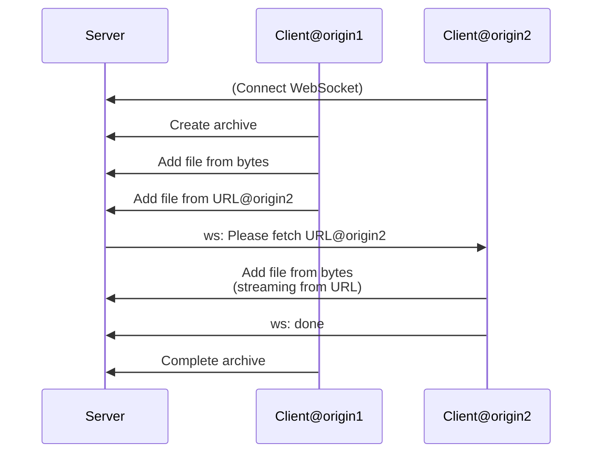

# ZIP Archive Server w/ Remote Fetch Proxy

- WebSocketを経由して別オリジンの別タブで動いているスクリプトに指示を出す
  - 微妙に無駄を省こうと特化実装にしてしまったが、純粋なRPCプロキシにしたら汎用できそう
- Fetch Upload Streaming
  - GETしたものをPUTに横流しする
  - 最終的にzip.jsに渡すところまでストリーミング（のはず）
- フロント用のJSをサーバーのソースコード中にTypeScriptで書く（？）
  - 関数をtoStringしたらJSの文字列が取れる
  - TypeScriptで書けるしサーバー向けに定義した型が流用できる
